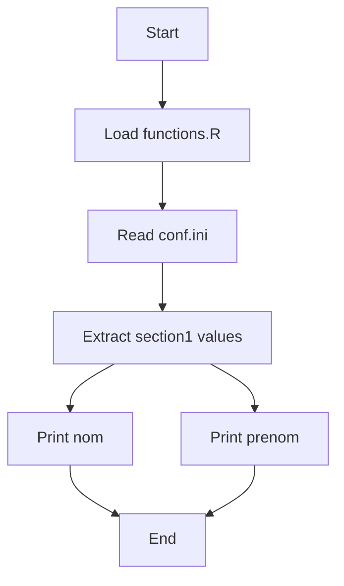

# README

## Overview
This script loads configuration parameters from an `.ini` file and prints selected values to the console. It is designed to demonstrate how to separate configuration from code using external files.



## Code Explanation
```r
source("src/functions.R")
params <- read.ini("conf.ini")

message(params$section1$nom)
message(params$section1$prenom)
````

### Step-by-step:

1. **Load custom functions**

   * `source("src/functions.R")` loads additional R functions required by the script.

2. **Read configuration file**

   * `read.ini("conf.ini")` reads the `.ini` file and stores it in the `params` object.
   * The `.ini` file is expected to have sections and key-value pairs.

3. **Access configuration values**

   * `params$section1$nom` retrieves the value of `nom` under `section1`.
   * `params$section1$prenom` retrieves the value of `prenom` under `section1`.

4. **Display output**

   * `message()` prints the values to the console.

## Example `conf.ini`

```ini
[section1]
nom=Smith
prenom=John
```

## Requirements

* R (>= 3.5 recommended)
* A package or custom function that provides `read.ini()` (e.g., `ini` package)

## How to Run

1. Make sure your working directory is set to the project root.
2. Run the script in R:

```r
source("main.R")
```

## Expected Output

```
Smith
John
```

## Notes

* Ensure the `conf.ini` file exists and follows proper `.ini` formatting.
* Modify `section1`, `nom`, and `prenom` as needed for your use case.
* You can extend the configuration file with additional sections and parameters.

## License

This project is provided as-is for demonstration purposes.

```
```
